# Go architecture

Dependencies point inward. Interaction transports, CLI, network, Raft, tmux,
and filesystem code may depend on application/domain contracts; the domain
imports none of them.

The daemon starts interface implementations through the small
`internal/interaction.Adapter` lifecycle. Telegram-specific responsibilities
are split by cohesion: `internal/telegrambot` owns bounded Bot API transport and
private-DM parsing; `internal/telegramapp` owns update routing, delivery
coordination, and background lifecycle; `internal/telegramview` projects
actor-authorized state and opaque callback tokens into semantic
`internal/telegramui` screens. The view package owns no Bot API transport or
background workers, and an architecture test prevents those dependencies from
returning. `internal/application` exposes actor-authorized use cases and
transport-neutral domain data; it does not import Telegram UI or callback
contracts. A future Web, Matrix, or native client supplies another adapter over
the same application service and does not change domain, consensus, membership,
or session-runtime packages. Architecture tests reject Telegram imports from
application and those core packages.

Each machine runs one `bria` control daemon. On untrusted Linux execution
hosts, provider CLIs and tmux run in a separate non-root `bria runner` identity
over a bounded Unix-socket protocol. The runner receives no node certificate,
Raft state, Telegram token, callback key, updater access, or ACL operation;
see [Linux backend isolation](linux-runner-isolation.md).

Node settings always expose the supported `claude` and `codex` backends. An
explicit install action invokes npm with a fixed official package name and a
user-owned prefix under the provider runtime home; Bria never uses `sudo` or a
system package directory. With runner isolation enabled, installation and
later execution both occur inside the separate runner identity. Only a
successful version probe refreshes inventory and permits the explicit Bria
connection; host discovery alone never grants provider access.

A no-init supervisor or a
platform service manager is an operational wrapper, not a second application
authority. Linux systemd support is independent of AMD64 versus ARM64;
Android/chroot environments use the no-init profile because PID 1 is not
systemd.

## State boundaries

Replicated:

- node identity, display name, status and capabilities;
- the sole Telegram owner and its automatically granted node set (legacy
  role/grant fields remain snapshot-compatible but are not exposed);
- normalized per-node/provider quota snapshots, refresh requests and the
  manual/automatic leader policy; provider credentials and raw quota output
  remain local;
- session metadata, provider identifiers, owner and navigation (legacy grants
  remain decodable);
- preferences, archive metadata and administrative audit events;
- operation IDs required for idempotency.
- bounded per-session input queues for temporarily unavailable nodes. These
  contain only text or external file identifiers and metadata, never media
  bytes or transport credentials;
- the next Telegram update ID, so a new leader resumes the same durable stream.
- enrollment invitation hashes, pending decisions, node network/lifecycle
  state, and deleted-identity tombstones.

Node-local:

- tmux handles and process state;
- raw transcripts and project files;
- native archive artifacts;
- provider credentials;
- encrypted copies of cluster-shared secrets.
- the cluster CA private key, enrollment plaintext secrets, Telegram token,
  and provider credentials. The CA key exists only on the issuer node.

Telegram media follows the same boundary. Raft and node-control requests carry
only bounded file IDs and metadata, never media bytes or the bot token. The
target runtime node resolves `getFile`, downloads directly from Telegram,
stores photos/documents in its session inbox, and transcribes voice locally.
The node-local speech adapter is selectable: whisper.cpp remains portable,
while macOS may invoke the separately signed Apple Speech helper with
on-device recognition enforced. All of those steps execute inside the existing
per-session FIFO, so a slow voice message cannot be overtaken by later text or
redirected by navigation.

Speech recognition is off by default. Once the owner enables it, the setting
is treated as desired state: the active interaction adapter reconciles every
current and newly enrolled enabled node, starts missing local setup, and keeps
macOS permission-required state visible for manual completion.

When a session's origin node is unavailable, the leader commits input to its
replicated per-session queue instead of attempting delivery. The global owner
preference bounds each queue to 5, 10, or 20 entries (5 by default). Recovery
dispatches only the head and removes it only after a terminal node-local
result; a leadership change or transient timeout retries the same operation
ID. New input joins an existing backlog even if the node has just recovered,
so it cannot overtake older text, audio, photos, or documents.

Session creation is a replicated-intent workflow. Raft first records a live
session in `starting`; the selected node then creates or resumes its provider
inside a deterministic tmux window and the leader publishes `idle`. The
node-local FIFO is prepared before the runtime is attached, so input accepted
during startup remains pinned to that session. A leader reconciler retries
every `starting` intent after process or leadership changes. Fresh Codex
sessions bind their provider-owned ID from rollout metadata because the Codex
CLI does not assign a caller-supplied session ID; fresh Claude sessions use an
assigned UUID.

## Reboot recovery

The replicated boot ID distinguishes a daemon restart from a host reboot. On
a new boot, the state machine deterministically selects live sessions whose
original idle deadline has not passed and moves them to `recovering`. The
origin node resumes each provider session in a deterministic tmux window; a
retry for the same boot and session reuses that window instead of spawning a
duplicate. Only a confirmed runtime start commits `active`. A failed resume is
committed as `archived/resume_failed`; `Lost` is reserved for sessions hidden
behind an unavailable origin node.

Telegram failure is downstream of durable command/event commit and cannot
delay an agent ACK. UI refreshes re-authorize the sole owner so a changed owner
identity stops old cards from updating.

Interactive adapters run only when local policy permits the current Raft
leader. Manual mode is the default. Before the first assignment, the current
leader exposes only the short leader-setup flow; after assignment, all other
nodes wait for the selected node. Automatic mode allows the current Raft leader
to serve immediately. For Telegram, leadership loss cancels the in-flight poll
and the next permitted leader reloads the replicated cursor. Each update also
scopes application operation IDs deterministically, so replay after an unknown
cursor-commit outcome reuses the command ledger instead of duplicating the
transition.

## Security

Raft streams require TLS 1.3 mutual authentication. Certificate identity uses
a stable cluster/node URI rather than an IP SAN. The custom dial verifier still
performs CA chain, validity, usage, cluster, and exact expected node-ID checks.

Enrollment tokens are random, short-lived, single-use, and stored only as
SHA-256 digests. A token creates a pending request; membership and secret
delivery occur only after Telegram approval.

The invitation contains the public CA certificate, issuer identity, endpoint,
and one-use secret. A joining node generates its Ed25519 key locally, submits a
signed contract over pinned TLS, and proves possession on every status poll.
Approval adds the node to desired membership; a leader-only reconciler changes
HashiCorp Raft membership one server at a time. In manual mode it enrolls other
nodes as nonvoters; automatic mode promotes them to voters. The issuer returns
a certificate for that exact public key and never receives the private key.
Only that configured issuer identity may forward a validated enrollment
request to the leader.

`Disabled` is a replicated administrative state distinct from temporary
offline reachability. Disabled nodes cannot create or control sessions, leave
Raft voting, and remain visible in settings. During removal, Raft transport
trust is retained only until the old voter configuration commits; node-control
access is revoked immediately. Deletion requires `Disabled`, leaves host-local
files untouched, and records an identity tombstone.

The replicated node fingerprint pins each stable node ID to one Ed25519 key.
Renewal certificates carry a CA-signed link to the previously active key, so a
restarted node can rejoin without a trust gap. Its first authenticated heartbeat
atomically advances the replicated fingerprint; the old key is then rejected
by node-control and Raft peers. Heartbeat certificate fields are derived from
the mTLS peer certificate, never trusted from the request body. For a suspected
key compromise, disable the node and then delete it after voter removal; normal
renewal is not a substitute for incident revocation.

Logical backups contain only the versioned cluster-state snapshot and command
ledger. The current leader signs the envelope with its committed node key;
restore verifies the CA identity and matching fingerprint from the backed-up
state. Restore never rewrites live Raft storage: an operator must retain or
move the old directory, stage the verified envelope against a fresh directory,
and let the new single-node leader apply it as one idempotent command.

Consensus is supplied by the upstream Raft library. Bria does not implement
or modify the Raft algorithm.

## Safe topology

A single node is a valid standalone cluster. Manual mode makes the selected
leader the sole voter and keeps every other enabled node as a nonvoter. The
leader therefore continues committing when every replica disconnects. A
nonvoter never starts an election, so an unavailable selected leader is not
replaced and cannot be changed until it returns. Normal nonvoter log catch-up
is best effort; provider transcripts remain origin-local. To avoid continuously
dialing an absent host, a nonvoter that has remained offline for two minutes is
parked by removing only its Raft replication membership. Its enabled lifecycle,
identity, settings and sessions remain intact. A new authenticated heartbeat
returns it as a nonvoter. The leader's one-second offline sweep reads replicated
timestamps in memory and never probes parked hosts over the network.

Runtime heartbeats normally run every five seconds and mark a node offline after
15 seconds without evidence. A node that cannot reach the leader backs its own
heartbeat attempts off through 5, 10, 20, 40 and 60 seconds, capped at one
attempt per minute. Any success resets the normal five-second interval.

Changing the manual leader while the old leader is reachable first promotes
the target, transfers leadership, and then demotes the old voter. No forced
transfer or recovery election occurs after the old leader becomes unavailable.

Automatic mode promotes enabled nodes to ordinary voters. Its failover safety
requires an odd quorum, normally three voting nodes. A two-voter automatic
cluster may operate while both members are connected, but after either member
is lost the survivor cannot safely elect itself. Bria uses upstream Raft
membership transitions and never implements forced two-node election logic.

## Go engineering standard

- New production source files are capped at 320 physical lines; small cohesive
  packages and narrow interfaces are preferred over multipurpose modules. CI
  carries an explicit publication-time baseline for older oversized modules:
  they may shrink but cannot grow.
- `gofmt`, `go vet`, package tests, race tests on Linux, and supported-target
  cross-builds are release gates.
- Code follows the Go specification, Effective Go and standard Go review
  conventions where they improve clarity and safety. These are guidelines,
  not excuses for ceremonial abstractions or mechanically splitting readable
  logic.
- Context cancellation, wrapped errors, deterministic state-machine code,
  explicit ownership and argv-based process execution are mandatory at I/O and
  concurrency boundaries.
